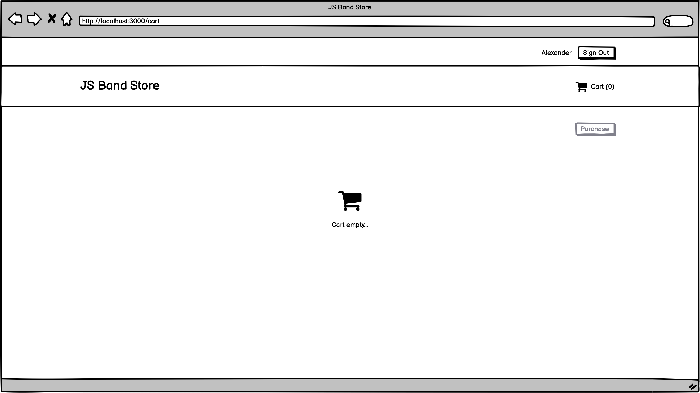

# Final task

You have a new client, it’s **“JS Band”** internship company. They want to create online shop, Book online shop.

## Objectives
- Create a JS Band Store application. Which includes next functionality:
    - User can log in with email and password;
    - Browse books catalog;
    - Search book by **title**;
    - Filter book by **price** (dropdown options: 0 < price < 25, 25 < price < 50, price > 50);
    - Browse specific book details;
    - Add a specific book to cart;
    - Browse Cart with added books;
    - Make a purchase of added books;
- For task implementation you must use:
    - `React`, `Redux`
    - Functional React components;
    - [`Create React App`](https://create-react-app.dev/) as a boilerplate;
    - `eslint-config-airbnb` config for ESLint;
    - `Github pages`;
    - `Github project`.
- For testing, you should use `Jest`: 
    - test coverage of your project should be at least 50%;
- For running eslint and test you should use pre-commit hooks:
    - use `Husky` for using pre-commit hooks;
- Yours web-application fields validation should be based on **Validation** provided in the **Arch notes** section;
- Yours web-application should be based on **Wireframes** provided in the **Arch notes** section;

## Scenarios
1. **User** goes to the `JS Band store` website;
2. If **User** unauthorized **System** redirects the user to the **Login** page (That's the only page available for unauthorized user);
3. **User** login with email and password, **System** redirects User to the **Book catalog** and store token in LocalStorage and Application State;
4. **User** see the list of books (provided by Firebase); Search by book name, filter list by the price;
5. **User** navigate to the specific **Book details** clicking on `View` button;
6. **User** choose the needed count of books, sees the total price, and adds the book to the cart. Then **User** can navigate back to the catalog or go forward to the **Cart**;
7. **User** goes to the **Cart**, see order list and press 'Purchase' button;
8. **System** place order, show a modal window with ordered items and successful message, and clear the cart;
9. Then **User** sign out, **System** redirects the User to the **Login** screen.

## Arch notes
#### Validation
- `email`: required, email validation rule;
    - errorMessage: 'Email is not valid'
- `password`: required, minLength: 4, maxLength: 16;
    - errorMessage: 'Password is not valid'
- `count`: user can add only available count of books to the cart

#### Screens
- Login screen:
  

- Books catalog screen:
  

- Book details screen:
  

- Cart screen:
  

- Empty Cart screen:
  

- Purchase complete screen with modal:
  

## Acceptance criteria

- All listed functionality should be provided and work;
- `React` should be used for task implementation;
- `Redux` should be used as a state management ;
- Only own created components should be used;  
- Only functional react components should be used;
- Components should be placed in separated files (don't forget about modularity);
- Code should be linted with `eslint-config-airbnb`;
- Other routes should be unavailable and respond with `not found` UI;
- Only `/login` and `/not-found` routes should be available for the unauthorized user, another else should be restricted;
- `Pull requests` mechanism should be used for making changes into the repository;
- The project should be deployed to the `GitHub pages`;
- Tasks should be decomposed and defined in `Github project` board (at least `7` tasks);
- Usage documentation should be provided;
- Test coverage should be at least 50%;  
- Use `Husky` for pre-commit hooks and add linting and testing on pre-commit;
