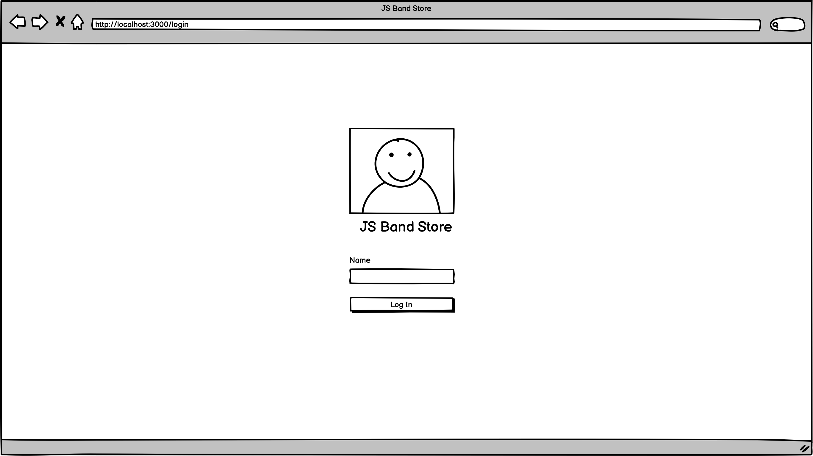

# Final task

You have a new client, it’s **“JS Band”** internship company. They want to create online shop, Book online shop.

## Objectives
- Create a JS Band Store application. Which includes next functionality:
    - User can signin with username;
    - Browse books list;
    - Search book by **title**;
    - Filter book by **price** (dropdown options: 0 < price < 15, 15 < price < 30, price > 30);
    - Browse specific book details;
    - Add specific book to cart;
    - Browse Cart with added books;
    - Make a purchase of added books;
- For task implementation you must use:
    - `React`, `Redux`, `Bootstarp CSS`
    - Custom react components;
    - [`Create React App`](https://github.com/facebook/create-react-app) as a app starter;
    - `Airbnb/react` linter;
    - `Github pages`;
    - `Github project`.
- Yours web-application fields validation should based on **Validation** provided in the **Arch notes** section;
- Yours web-application should based on **Wireframes** provided in the **Arch notes** section;
- Yours web-application should based on **API** provided in the **Arch notes** section.

## Scenarios
1. **User** goes to the `JS Band store` website;
2. If **User** unauthorized **System** redirect user for **Sign-in** screen (That s only screen available for unauthorized user);
3. **User** sign-in with username, **System** return user token (API provide token), redirects User to the **Book list** and store token in LocalStorage and Application State;
4. **User** see the list of books (provided by API); Search by book name, filter list by the price;
5. **User** navigate to the specific **Book details** clicking on 'View' button;
6. **User** choose needed count of books, see total price and add the book to the cart. Then **User** can navigate back to the list or go forward to the **Cart**;
7. **User** goes to the **Cart**, see order list and press 'Purchase' button;
8. **System** place order (via API), show successful message and clear the cart;
9. Then **User** sign-Out, **System** redirect User to the Sign-In screen.  

## Arch notes
#### Validation
- `username`: required, minLength: 4, maxLength: 16;
  - errorMessage: 'Field is not valid'
- `count`: user can add only available count of books to the cart  


#### Screens
- Sign-in screen:


- Full books list screen:


- Specific book screen:


- Cart screen:


- Purchase complete screen / Cart empty state:


#### API

1. `POST` [https://js-band-api.glitch.me/signin](https://js-band-api.glitch.me/signin)

```js
// request
{
  "username": "String" // minLength: 4, maxLength: 16
}

// response
{
  "username": "String",
  "avatar": "String",
  "token": "String"
}
```

2. `GET` [https://js-band-api.glitch.me/books](https://js-band-api.glitch.me/books)

```js
// header
{
  "Authorization": "Bearer {token}"
}

// response
// success
"statusCode": 200,
"data": {
  "books": [
     {
       "id": "String",
       "count": "Number",
       "price": "Number",
       "title": "String",
       "author": "String",
       "level": "String",
       "description": "String",
       "cover": "String",
       "tags": ["String"]
     },
  ]
}
// failure
"statusCode": 401,
"data": { "message": "Unauthorized" }
```

3. `GET` [https://js-band-api.glitch.me/books/:id](https://js-band-api.glitch.me/books/:id)

```js
// header
{
  "Authorization": "Bearer {token}"
}

// response
// success
"statusCode": 200,
"data": {
   "id": "String",
   "count": "Number",
   "price": "Number",
   "title": "String",
   "author": "String",
   "level": "String",
   "description": "String",
   "cover": "String",
   "tags": ["String"]
 }

// failure
"statusCode": 401,
"data": { "message": "Unauthorized" }
```

4. `POST` [https://js-band-api.glitch.me/purchase](https://js-band-api.glitch.me/purchase)

```js
// header
{
  "Authorization": "Bearer {token}"
}

// request
{ 
  "books": ["String"]
}

// response
// success
"statusCode": 200,
"data": { "message": "Thank you for purchasing books in our store!" }

// failure
"statusCode": 400,
"data": { "message": "Please provide list of ids in format: { books: [...] }" }

"statusCode": 401,
"data": { "message": "Unauthorized" }
``` 

## Acceptance criteria

- All listed functionality should be provided and work;
- `React` should be used for task implementation;
- `Redux` should be used as an state management ;
- Only custom react components should be used;
- Components should be placed in separated files (dont forget about modularity); 
- Code should be lintered with [`airbnb/react`](https://github.com/airbnb/javascript/tree/master/react) style guide;
- `Bootstrap CSS` should be used as a CSS library [link](https://getbootstrap.com/docs/3.4/css/);
- Other routes should be unavailable and respond with `not found` UI;
- Only `/signin` and `not-found` routes should be available for the unauthorized user, another else should be restricted;
- `Pull requests` mechanism should be used for making changes into repository;
- Linter check should be available on the CI;
- Deployment to the `GitHub pages` should be implemented via Travis-CI;
- Tasks should be decomposed and defined in `Github project` board (at least `7` tasks);
- Usage documentation should be provided;
- `Clear commit` approach based on tasks should be used;
- Deadline is `10:00am 16/12/2019`  
