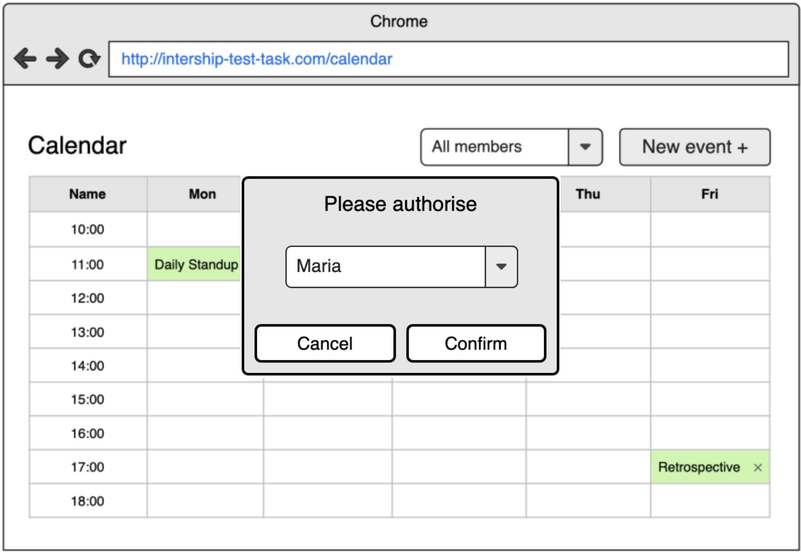

# Homework
Hi, welcome to the Homeworks section!

Your homeworks will be based on extension and enhancement of your test task. So please, make sure it is deployed to Github Pages in order to make it possible for our mentors to check it after every lecture.

Good luck and enjoy your practice time!
## Homework 1
Ok, so for your test task you had several users in our system. Let's upgrade them to the next level this time. Now you would need to create two Classes User (base class) and Admin (should be inherited from User). 

### Requirements:
 - Each team member should belong either to User class or Admin class.
 - When user opens an application he/she has to authorize himself using the select modal (like in the example mockup).
 - If authorized user is Admin he is able to create and update events(if Drag and Drop was implemented in your test task).
 - If authorized user is User he/she is not able to create/update events. This means that 'Create Event' button should be hidden for those users.

### Additional requirements:
- Please make sure your application meets the ES6 standard and uses all ES6 features where it is appropriate and possible.
 
 
 
## Homework 2
Ok, so for your test task you stored all your Events in localStorage. Now you need to implement CRUD operations for events. We have created small server to store Events.

You can find API documentation here: http://158.101.166.74:8080/swagger/index.html

API endpoints have next parameters:
 - *system* - it should be applicant's firstname and lastname, for example for John Doe use 'john_doe';
 - *entity* - entity name, in our case should be 'events';
 - *id* - unique identifier that will be created by API automatically.

### Requirements:
 - All Events should be stored on BE side
 - For communicating with API you may use Fetch, Axios etc...
 - Implement create Event via POST method - http://158.101.166.74:8080/api/data/{system}/{entity}

        Example of payload:
        ```
         {
           data: **Data in JSON format**
         }
        ```
 - Implement delete Event via DELETE method - http://158.101.166.74:8080/api/data/{system}/{entity}/{id}
 - To retrieve all Events use GET method - http://158.101.166.74:8080/api/data/{system}/{entity}
 - If you have drag'n'drop you should update Event via PUT method - http://158.101.166.74:8080/api/data/{system}/{entity}
 - For each API call implement Notification that indicates a successful response.

### Optional requirements:
 - Please use async/await for handling API responses
 - Store users in API (create separate *entity* called 'users' and retrieve them via GET method)

## Homework 3
At this moment, you have an application that can interact with the backend. You need to improve code and use patterns such as Singleton, Factory Method, and optional Decorator.

### Requirements
- Use class for interaction with the backend
- Should create only one instance  of this class
- Should be all possible error in API processed via a decorator approach

### Optional requirements:
- Communication with server should be implemented by using Event emmitter pattern

## Homework 4
In this homework you have to enhance your project with development tools. 

### Requirements
- Add ESLint to your project. It should use `eslint-config-airbnb`
- Add and setup Jest. Create unit tests for business logic CRUD operations and Event creation form (at least 5 tests)
- Add Webpack to your project. It should use loaders for *.js, *.scss files and add plugins that minified your javascript code
- Describe application launch process and commands that you have in README.md

### Optional requirements:
- Add Prettier
- Add stylelint

## Homework 5
In this homework, you have to migrate your project to React.

### Requirements
- Create a new repository for React project
- Setup React boilerplate via [CRA](https://create-react-app.dev)
- Transfer Calendar page functionality from your Vanilla JS to React
- Use functional components

### Optional requirements:
- Add ESLint

## Homework 6
This homework based on Homework 5. Now you have to migrate other parts of your meeting-app to React.

### Requirements
- Migrate Create Event modal/page to react functional component
- New event-form should be implemented via native forms functionality (3-rd party libraries forbidden)
- Validation should be synchronous for each field in the form
- For the main page use corresponding hooks to be able to fetch the data from API
- Current User functionality should be implemented via React Context API
- Use functional components

### Optional requirements:
- For those who has d’n’d functionality rewrite it with [ReactDnD](https://react-dnd.github.io/react-dnd/docs/api/hooks-overview) library
