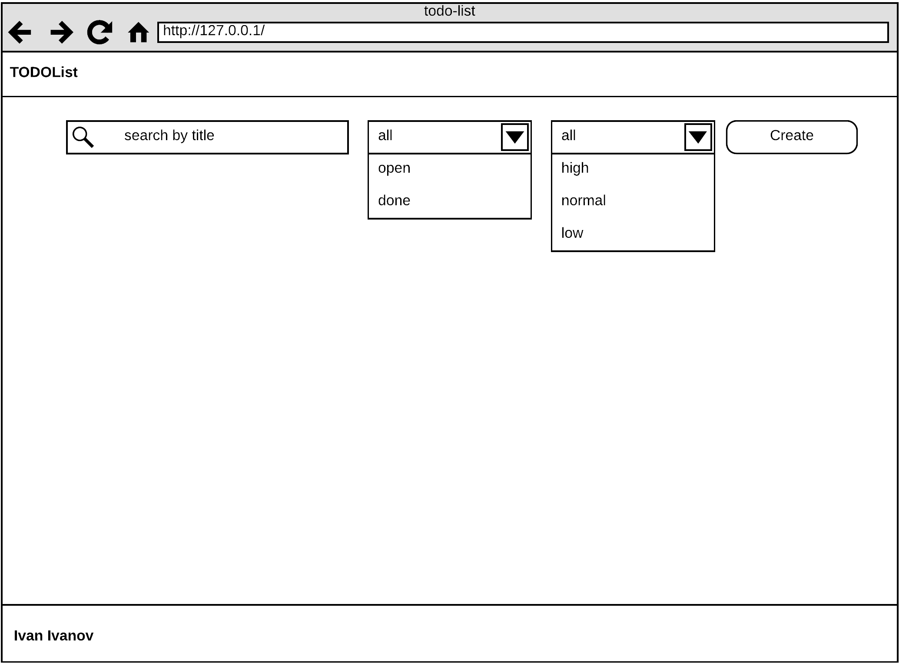
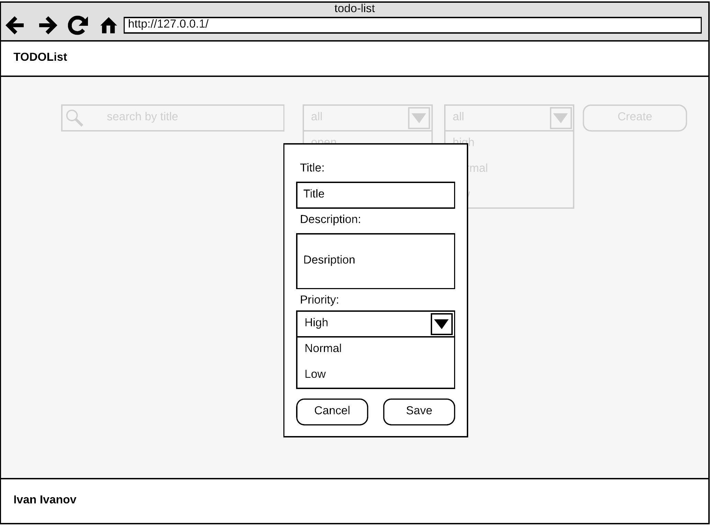
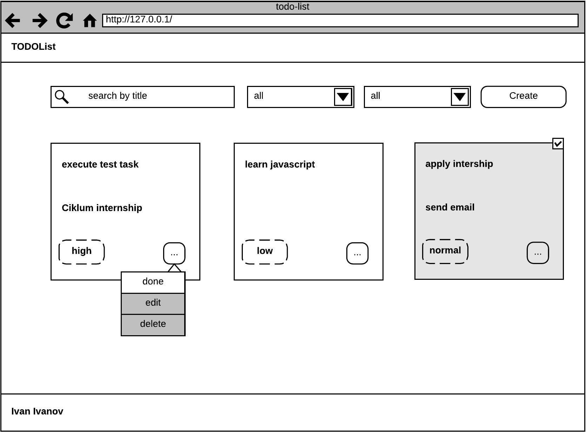
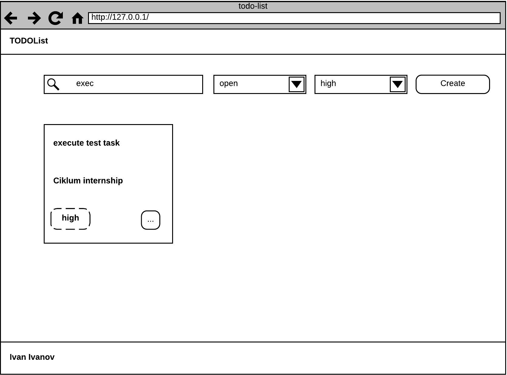

# Homework

## Github projects

- All repositories should be `separate` and created at `your personal GitHub account`
- Name convention for the repos, next:
 
```js
// test task
const test_task = {
  name: 'js-band-test-task',
  description: 'Ciklum University: JS Band Internship. Test task'
}

// homework task 
const homework_task = {
  name: 'js-band-hw-task-1',
  description: 'Ciklum University: JS Band Internship. Homework task'
}

// final_task
const final_task = {
  name: 'js-band-final-task',
  description: 'Ciklum University: JS Band Internship. Final task'
}
```


## Homework 1

We have a new potential client, it’s one of the biggest logistics companies **“JS Band Delivery”**.
It uses two types of transporting **by trucks** and **by railway**. The company has a plan to diversify transportation types and introduce new ones, such as **Aero**.
That is why the system should be flexible to such type of changes.
The client asked about Discovery phase on this stage. The result of this phase should be a POC of the tracking system that helps them to collect data about their own transport.

What type of information they want to collect:

**Ships/Argosy:**
- id 
- Model
- Serial number/Name
- Produced year
- Capacity (in kg)
- Average speed (in nm)
- Count of team


**Trucks:**
- id
- Model
- License plate
- Produced year
- Capacity (in kg)
- Average speed (in km)
- Type of gas


**Cost of delivery:**
- Transport Model
- Cost (by 1 kg of cargo)
- Cost (by 1 km of distance)


### Objectives

- Prepare the structure of the transports based on inheritance and classes;
- Prepare classes for cost of delivery;
- Prepare simple functionality for adding data to catalogs;
- Implement two methods (one inherited, one overloaded) for each type of transport:
    - overloaded `showAverageSpeed()` - should show for Track kilometers ex. 100km, for ships nautical mile for ex. 100nm
    - inherited `showCapacityInPounds()`
- Split all functionality into modules.

### Arch notes

- Nice UI isn’t required (just inputs and simple lists)
- Bundlers isn’t required you can use native ES6 modules
- Example of default data:

```js
const DEFAULT_SHIP = {
  id: 'xxxxx-qqqqq-aaaaa',
  model: 'Combo',
  name: 'JS Band Ship',
  producedYear: '2019',
  capacity: '200000',
  averageSpeed: '20',
  countOfTeam: '83'
};

const DEFAULT_TRUCK = {
  id: 'smrta-asdad-deead',
  model: 'MAN TGX D38',
  licensePlate: 'AA1232OO',
  producedYear: '2018',
  capacity: '12000',
  averageSpeed: '110',
  typeOfGas: 'Diesel'
};
```

### Acceptance criteria
- User can fill catalogs:
    - add new ship (first form)
    - add new truck (second form)
    - add cost of delivery information (third form)
- User can see list of added transport;
- User can see list of added cost of delivery;
- Information should be stored into `local storage`;
- Functionality should be split into `modules`;
- Functionality should be implemented via `Class` statement;
- Two methods should be implemented.


## Homework 2

During the implementation of our POC, we found the issue with the backend.
 On the backend side, we have haven't a method for retrieving all data 
for a list of trucks. We have had two methods:

```js
function getTruckIdsCallback(callback) {
    setTimeout(() => {
        callback([1,2,5,9,67]);
    }, 1000)  
}

function getTruckIds() {
    return new Promise((resolve => {
        getTruckIdsCallback(result => resolve(result));
    }));
}

function getTruckByIdCallback(id, callback) {
    setTimeout(() => {
        const isError = Math.ceil(Math.random()*1000) < 100;
        if (isError) {
            return callback(undefined, "Internal error"); 
        }
        callback({
            id: id,
            model: `truck ${id}`
        });
    })  
}

function getTruckById() {
    //Please implemented this method use getTruckByIdCallback
}
```

We want to implement a new method for retrieving information about trucks:

```js
// callback(list, err) 
// list - list of trucks
function getTruckListCallback(callback) {
    
}

function getTruckListPromise() {
    return new Promise(((resolve, reject) => {
        ...
    }))
}

async function getTruckListAsynAwait() {
    ...
}
```

### Objectives

- Create the method for retrieving data for the list of trucks from the backend.

### Acceptance criteria
-  ```getTruckListCallback``` (use methods with callback) should be implemented
- ```getTruckListPromise``` (use methods with promise) should be implemented
- ```getTruckListAsyncAwait``` (use async, await) should be implemented
- Methods should try to get document again if received error, but no more than two times
    - if the error happens more than two times, the method should skip this truck

## Homework 3

We had the audit of our PoC. And now we have few suggestions about our solution.
First, it's better to create different types of transports by using Factory Method.
Second, we need to prepare service for local storage as a Singleton and set prefix what will be added to the key name.

### Objectives:
- Update your existing functionality by using Method factory
- Implement service for the local storage as Singleton

### Arch notes:
Example about prefix: we try to save ‘token’ with value ‘1234’ to the storage and we set prefix ‘JS-Band-’,
we will have ‘JS-Band-token’ as a key and ‘1234’ as a value in the local storage.

### Acceptance criteria:
- New transport is created by using Factory Method pattern.
- Functionality should work as before
- Push you application into github pages
- Local storage prefix should be set one time on the application initialization

## Homework 4

Our PoC looks nice for the client and we should start preparation for the project development. We should define quality processes and tools and prepare our project for effective development.

### Objectives:
- Add eslint to our project
- Add commitizen tool to improve commit messages and log history
- Add and setup Jest for implementing autotest 
- Add Webpack config for dev prod and common
- Describe application launch process and commands what we have
- Describe structure of our project

### Acceptance criteria:
- Eslint should be available and we should have a command for launching linting check in the scripts
- Commitizen should be added into our project and all changes in our project should be committed by using this tool
- Webpack should have at least 3 parts common, dev and production builds
- Description of all our scripts should be available in our readme.md file
- Description about the structure of the project should be available
- At least one dummy test should be available
- Lint check and the run test should be executed on the commit

## Homework 5

We prepared quality checking systems, like eslint, jest and now.
We should prepare CI/CD setting for more effective delivery process. We are going to prepare it for our PoC. And additionally, we should start to write unit tests.

### Objectives:
- add eslint to our project
- prepare travis-CI pipeline settings
- add installation step
- add linter step
- add automation tests step and add coverage report
- add deployment to the GitHub pages
- implement tests for our functionality


### Acceptance criteria:
- pull requests mechanism should be used for making changes into repository
- linter and testing check should be available on the CI
- deployment to the GitHub pages should be implemented by Travis-CI
- clear commit approach should be used
- test coverage should be more then 40%


## Homework 6
### Objectives

- Create a todo-list application. Which includes next functionality:
    - Create a todo-item with a **title**, **description**, **priority** fields and a default status - **open**;
    - Edit all todo-item fields;
    - Move todo-item in **done** status;
    - Delete todo-item
    - Search todo-item by **title**;
    - Filter todo-item by **status**;
    - Filter todo-item by **priority**.
- For task implementation you must use:
    - `React` with `Babel` transpiler;
    - `Bootstrap CSS` as a CSS library [link](https://getbootstrap.com/docs/3.4/css/);
- Routing:
    - Application should start from `/todos` route;  
    - Todo list should be available under  `/todos` route;
    - Other routes should be unavailable and respond with `not found` UI. 
- Your application should be based on Wireframes provided in the **Arch notes** section

### Arch notes

- Empty state:


- Create/Edit state:


- Common state: (*the last one is done)


- Filtered state:


### Acceptance criteria

- `React` should be used for task implementation;
- Only custom react components should be used;
- Components should be placed in separated files (dont forget about modularity); 
- React code should be lintered with [`airbnb/react`](https://github.com/airbnb/javascript/tree/master/react) style guide;
- `Bootstrap CSS` should be used as a CSS library [link](https://getbootstrap.com/docs/3.4/css/);
- Todo list should be available under  `/todos` route;
- Other routes should be unavailable and respond with `not found` UI;
- Webpack config should be provided;
- Pull requests mechanism should be used for making changes into repository;
- Linter check should be available on the CI;
- Deployment to the GitHub pages should be implemented via Travis-CI;
- Clear commit approach should be used.


## Homework 7
### Objectives

- Add to your React application state management;
- For task implementation you should use `Redux`.

### Acceptance criteria

- `Redux` should be used as state management library;
- Create, edit, remove, filter, search should be implemented with `Redux`;
- Use branch strategy from previous lecture;
- Application should be deployed to github pages;
- Use `Travis CI` for continuous deployment.


