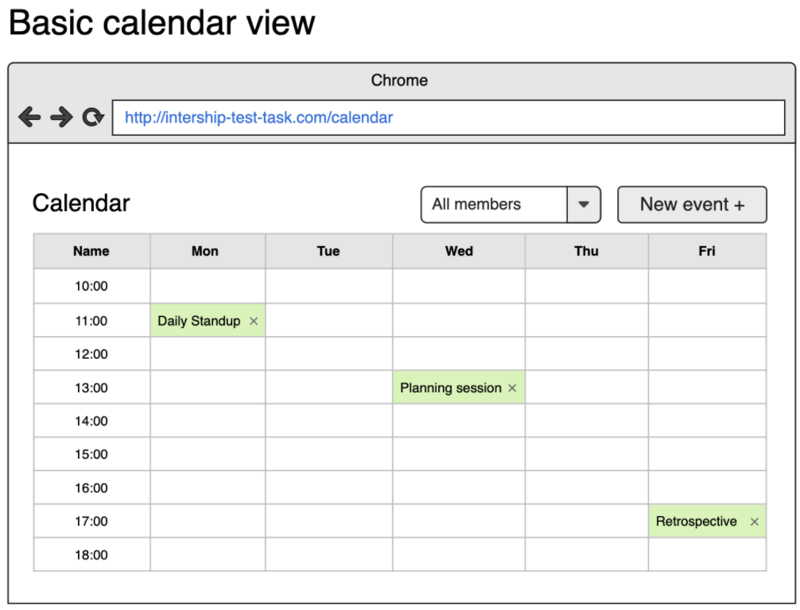
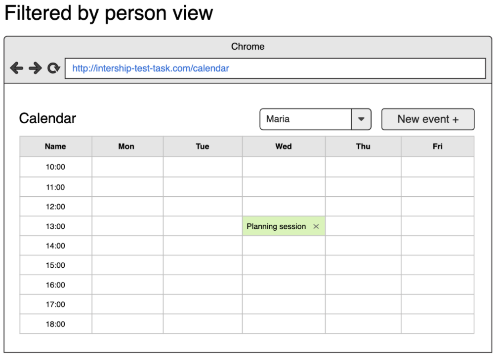
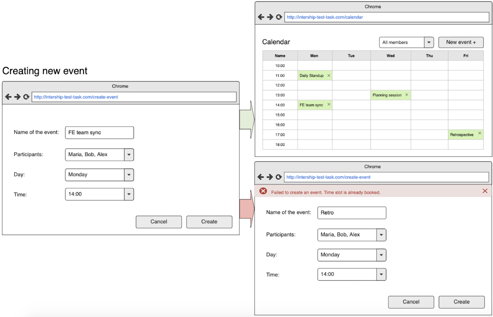
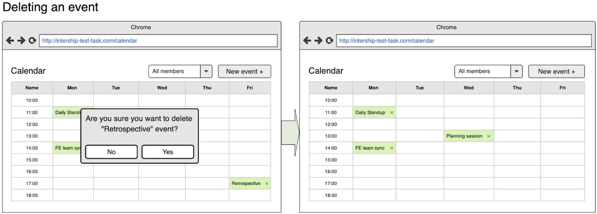

# Tech task [PENDING]
## Objectives
Create a simple meeting planning calendar for a meeting room in your office:
- Display meetings planned;
- Filter meetings for a particular team member;
- Add new meetings;
- Delete meetings;
    
## Tech stack    
- pure `JavaScript (ES6, ES next)` with `Babel` transpiler (if needed) without frameworks;
- any `CSS` pre/post processor (ex. `Sass / Scss / Post-CSS` etc.);
- any module bundler (ex. `Webpack / Rollup` etc.);
- any other technologies that you’d like;

## Prerequisites
- You are building a meeting scheduler application for one meeting room.
- Your application should have two screens: “Calendar” screen and “Create event” screen;
- “Calendar” screen consists of a pre-defined table with 5 days (Mon-Fri) for columns and 9 time slots (10:00-18:00, one hour long each) for rows;
- There is a team of several people that can take part in the meetings (you can hardcode the list of team member in your code).
- One meeting can take only 1 hour and obtain one cell in the “Calendar” screen;

## Basic feature requirements
- On a “Calendar” screen user should be able to see all meetings scheduled for the meeting room;
- User should be able to filter meetings by person;
- In order to create new meeting user should click “New Event+” button at “Calendar” screen, after that he should be transferred to “Create event” screen. At that screen user should enter meeting title, select participants (can be multiple), select day (Mon-Fri), select time (10:00-18:00);
- The meeting can be successfully created if and only if the time slot for that day and time is free. Otherwise the error bar should be shown.
- After successful creation of an event, the user should be transferred back to the “Calendar” screen where new event should already be displayed.
- In order to delete a meeting user has to click the delete icon near the meeting title at “Calendar” screen and then confirm his action in a confirmation dialog.

## Optional feature requirements
- Implement UI based on different UI frameworks of your choice like: Bootstrap etc.
- Implement possibility to change meeting day/time using drag and drop technique on “Calendar” view.

_Your application should be based on Wireframes provided below, but design can differ:_

## Acceptance criteria
- Only `JavaScript` should be used for task implementation;
- JavaScript code should be lintered with [`airbnb/javascript`](https://github.com/airbnb/javascript) style guide;
- Any `CSS pre/post processor` should be used for task implementation;
- Any `module bundler` should be used for task implementation;
- Usage documentation should be provided in a `README` file;
- The solution should be placed on your own `GitHub` account;
- The solution should be placed on `GitHub pages`;
